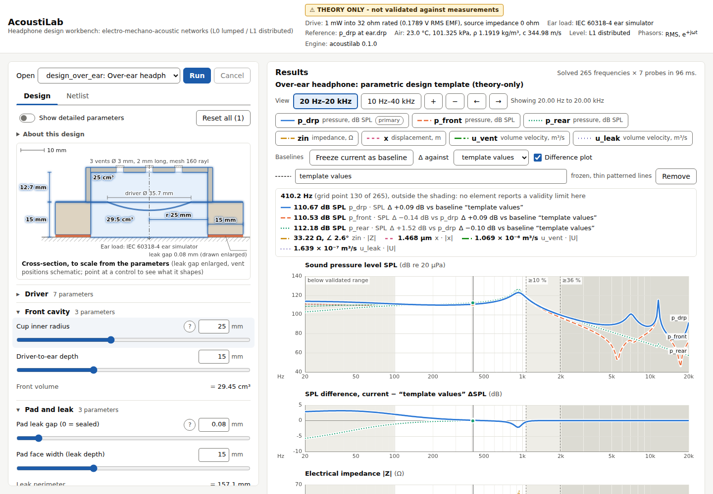

# AcoustiLab

A headphone design and simulation workbench. At its core is a generic
modified-nodal-analysis solver over a typed electro-mechano-acoustic netlist,
with a thermoviscous element library.

The design specification is `docs/spec/AcoustiLab_v2_spec.pdf`. Its known errors
and their corrections are in `docs/spec-errata.md`. The engine's normative
conventions (analogy, phasors, validity metric) are in `docs/conventions.md`.

**Status: theory-only.** Every model is built from physics, standards and
published data. Nothing has yet been validated against a measurement rig, so
treat absolute levels as predictions, not as measured facts. Comparisons
between designs are more reliable than absolute values.

## Layout

```
crates/acoustilab        engine library (Rust, builds for native and wasm32)
crates/acoustilab-cli    `acoustilab` command-line runner
crates/acoustilab-wasm   wasm-bindgen wrapper used by the web UI
web/                     browser UI (Vite + TypeScript), see docs/web.md
data/                    driver records, ear-load and material parameters (with provenance)
tools/                   Python generators for reference fixtures and fits
docs/                    spec, errata, conventions, netlist and parameter reference, ear loads, web UI
examples/                example netlists
```



## Build and run

```sh
cargo test                                   # unit, oracle and property tests
cargo run -p acoustilab-cli -- types         # list element types
cargo run -p acoustilab-cli -- solve examples/sealed_cup.json --csv
cargo build -p acoustilab --target wasm32-unknown-unknown --release
```

The netlist format is described in `docs/netlist.md`. Netlists can declare
parameters and use expressions (`docs/parameters.md`);
`examples/design_over_ear.json` is a parametric over-ear design:

```sh
cargo run -p acoustilab-cli -- params examples/design_over_ear.json
cargo run -p acoustilab-cli -- solve examples/design_over_ear.json --set vent_count=3 --set rear=open --csv
```

On-ear and in-ear templates, and the sources behind every template's defaults, are in `docs/templates.md`.

Target curves (with provenance and fixture), response error metrics and
preference scores are described in `docs/targets.md`:
`cargo run -p acoustilab-cli -- score examples/design_over_ear.json --target ravizza2023_5128`.

To run the browser UI:
`cd web && npm ci && npm run dev` (details in `docs/web.md`).
