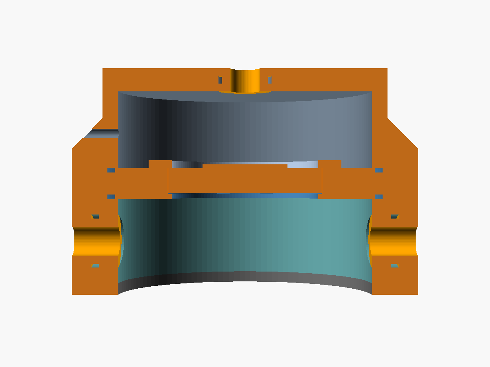

# Open reference cup

The validation artefact of spec Section 17: a 3-D printed circumaural cup
around the Tymphany HPD-40N16PET00-32 driver, designed so that its acoustics
are predictable and repeatable on a fixture, published with its geometry,
its model, its measurement protocol and blind predictions that were frozen
before any cup was built.

**Status (September 2026): designed, not yet built or measured.** The
predictions in `predictions/v1/` are blind. The model, the pipeline and the
checks are described in [`docs/reference-cup.md`](../../docs/reference-cup.md);
the measurement session is [`protocol.md`](protocol.md).



*Cross-section (cut faces orange): rear shell with its back plate and rear
plug (top), baffle with the driver and its retainer, pad ring with the two
front plugs, gasket (bottom).*

## Licence

Everything in this directory (geometry, dimensions, STL, protocol, frozen
predictions) is published under the Creative Commons Attribution 4.0
International licence, CC-BY-4.0
(<https://creativecommons.org/licenses/by/4.0/>). Attribute it as
"AcoustiLab open reference cup". The driver datasheet and the SAATI mesh data
sheet are the manufacturers' documents and are not redistributed here; only
the numbers the model uses are quoted, with their sources.

## Files

| file | content |
|---|---|
| `dimensions.json` | every dimension of the parts and every geometric input of the model, with tolerances and sources; also the print material data |
| `geometry/reference_cup.scad` | parametric OpenSCAD source; reads `geometry/dimensions.scad` |
| `geometry/dimensions.scad` | generated from `dimensions.json` by `tools/refcup/dims_to_scad.py` (do not edit) |
| `geometry/stl/*.stl` | every printed part in its print orientation (binary STL), with `SHA256SUMS` |
| `protocol.json`, `protocol.md` | the measurement session (machine-readable and for people) |
| `predictions/v1/` | the frozen blind predictions and their manifest |

The model is `examples/reference_cup.json`. `cargo test` checks that the
netlist's geometry parameters, `dimensions.json` and `dimensions.scad` agree
(`crates/acoustilab/tests/reference_cup.rs`).

```sh
python3 tools/refcup/dims_to_scad.py     # after editing dimensions.json
python3 tools/refcup/export_stl.py       # needs OpenSCAD (2021.01 used)
python3 tools/refcup/wall_check.py       # wall stiffness margins
```

Changing a dimension changes the model: a changed cup needs a new prediction
version (`acoustilab validate --predict --out validation/reference_cup/predictions/v2`)
before it is measured.

## Construction

```
   rear plug (sealed | hole | mesh)
        |
 +------+------+   rear shell: 66 mm bore, 20 mm deep, 6 mm back plate,
 |   rear      |               flange with six M3 x 18 screws
 |   chamber   |
 +--[retainer]-+   baffle, 8 mm: 38 mm lip, driver pocket, O-ring each face
 | [ driver  ] |
 +-------------+
 |   front     |=  pad ring, 22 mm high, 12 mm wide, two front ports
 |   cavity    |=  (plugs sealed | mesh) at 0 and 180 degrees
 +=============+   gasket: 3 mm closed-cell silicone sponge
    fixture (flat plate with IEC 60318-4, or head and torso simulator)
```

* **Driver seat.** The driver goes into the baffle from the rear, its front
  ring against a 1.2 mm lip through a 0.5 mm closed-cell foam ring, and is
  held by a printed retainer that presses only the outer millimetre of its
  rear rim, clear of its rear holes and terminals. The foam ring seals the
  path around the driver from front to rear.
* **Joints.** Baffle, pad ring and rear shell meet face to face on two
  68 x 1.5 mm O-rings in face grooves of the baffle, so the joints add no
  thickness to the cavities. Six M3 x 18 screws enter from the rear shell's
  flange and hold all three in heat-set inserts in the pad ring.
* **Plugs.** Every port takes a 14 mm plug sealed by an 11 x 1.5 mm O-ring,
  as long as its wall so that both faces are flush: rear plugs 6 mm (back
  plate), front plugs 12 mm (pad ring). Rear: `sealed`, `hole` (one 3.0 mm
  hole) and `mesh` (one 8.0 mm hole covered by Acoustex 260). Front, two of
  each: `sealed` and `mesh` (8.0 mm hole covered by Acoustex 260). The mesh
  is glued on the plug's outer face, the glue kept outside the hole. Plugs
  can be swapped while the cup stays on the fixture, with care: the O-ring
  takes a few newtons to pull or push, about the whole 5 N seating force,
  so steady the cup while doing it (protocol.md, "Swapping plugs"). Only
  the sealed plugs have an extraction feature (a pilot hole for an M3
  screw); pull the hole and mesh plugs by a tab of polyimide tape stuck to
  their rim, clear of the hole and the mesh.
* **Leak.** The gasket seals on a flat plate; the defined leak is the front
  mesh plugs (resistive, as a pad leak is, and set by a data-sheet flow
  resistance rather than a gap). What is left, the residual leak under the
  gasket, is the one leak the acceptance test fits.

## Bill of materials

| item | quantity | specification |
|---|---|---|
| driver | 1 | Tymphany HPD-40N16PET00-32 (40 mm, PET diaphragm, NdFeB, 32 ohm); datasheet <https://media.digikey.com/pdf/Data%20Sheets/Tymphany/HPD-40N16PET00-32_Spec.pdf> |
| acoustic mesh | 1 sheet, 3 discs of 13 mm | SAATI SAATIFIL ACOUSTEX 260: 260 MKS rayl, air permeability 800 L/(m2 s) at 20 mm water gauge, 18 um pores, 13 % open area, 60 um thick, 48 g/m2 (SAATI Acoustics technical data sheet ADS1200019EN V8, 2015-09-29, as distributed by Marian Inc. in 2019: <https://marianinc.com/wp-content/uploads/2019/09/2019-09-27-Saatifil-Acoustex-Precision-Woven-Mesh.pdf>; no tolerance is stated). Cut all discs from one sheet (the model uses one flow resistance for all ports). |
| gasket | 1 | closed-cell silicone sponge sheet, 3 mm, medium firmness; annulus 66 x 90 mm, glued to the pad ring (or self-adhesive) |
| driver seal | 1 | closed-cell foam tape 0.5 mm; ring 38 x 40 mm |
| joint O-rings | 2 | 68 x 1.5 mm NBR 70 |
| plug O-rings | 7 | 11 x 1.5 mm NBR 70 |
| joint screws | 6 | M3 x 18 socket head (ISO 4762) and 6 M3 heat-set inserts (5.7 mm, for a 4.0 mm hole) |
| retainer screws | 3 | M2 x 6 and 3 M2 heat-set inserts (for a 3.2 mm hole) |
| lead | 1 | two-core cable, 2 mm or thinner; non-hardening putty to seal the 2.5 mm exit |
| ring weight | 1 | for the flat plate: 510 g minus the assembled cup's mass (about 280 g), with a bore of 40 mm or more so that the rear port stays open, e.g. a steel ring 40 x 74 mm, about 12 mm high |
| printed parts | 1 set | baffle, retainer, pad ring, rear shell; rear plugs sealed, hole, mesh; front plugs 2 sealed, 2 mesh |

## Print notes

* **Material and settings.** PETG, 100 % infill, at least 4 perimeters,
  0.2 mm layers, printed in the orientations of the STL files (no supports:
  the rear shell's flange sits on a 45-degree skirt). Solid walls matter: a
  partly filled wall is a compliance and can be a leak.
* **Wall transmission.** With the 6 mm back plate and 4 mm side walls
  (`tools/refcup/wall_check.py`, E = 2.0 GPa, an estimate for PETG): the back
  plate's compliance is 0.1 % of the rear chamber's air, it passes 0.03 % of
  the meshed rear vent's flow at 20 Hz and 1.6 % at 1 kHz, and its first
  resonance is near 3.5 kHz. Solved with the back plate as a `shell` element
  (plate profile, its 3.5 kHz resonance, Q = 20; 96 points per octave), the
  drum response changes by at most 0.014 dB up to 4 kHz (0.6 dB near 19 kHz)
  and the impedance peak by 0.1 %. The walls can be
  taken as rigid; the gasket cannot (see below).
* **Holes that set acoustics** (the plug holes) and the pad ring's
  horizontal port bores are printed 0.4 mm undersize: drill the plug holes
  with new 3.0 and 8.0 mm drills and ream the ports to 14.2 mm.
* **Sealing faces** (baffle, pad ring, flange): check them flat on glass;
  sand if they rock.

## Build check (go / no-go)

Measure every part after post-processing and remake it when a value is
outside its limit, so that the frozen predictions still describe the cup.
The limits are the tolerances in `dimensions.json`:

| dimension | nominal | limit | tool |
|---|---|---|---|
| cup bore (pad ring, rear shell) | 66.0 mm | +- 0.2 | calipers |
| pad ring height | 22.0 mm | +- 0.1 | calipers |
| pad ring width | 12.0 mm | +- 0.1 | calipers |
| rear chamber depth | 20.0 mm | +- 0.2 | depth gauge |
| back plate at the port | 6.0 mm | +- 0.1 | calipers |
| front lip opening / thickness | 38.0 / 1.2 mm | +- 0.2 / 0.1 | calipers |
| rear hole | 3.00 mm | +- 0.05 | pin gauges 2.95 / 3.05 |
| rear and front mesh holes | 8.00 mm | +- 0.05 | pin gauges 7.95 / 8.05 |

Then the leak check: with every plug sealed and the cup on the flat plate,
the drum response from 20 to 100 Hz must be flat within 0.5 dB (the frozen
prediction `iec_sealed_p` varies by 0.3 dB there). A lower level at 20 Hz
means a leak: at the driver seat, a joint, a plug or the lead exit.

## What the model does not include

The driver's internal rear volume and rear holes (the datasheet does not
describe them), the air load folded into the datasheet's moving mass, the
gasket's own compliance, the pinna's acoustics on a head and torso
simulator, the damping of a damped IEC 60318-4 simulator, and the flow
dependence of the open rear hole's resistance. Where each shows up in the
comparison is in [`docs/reference-cup.md`](../../docs/reference-cup.md).
